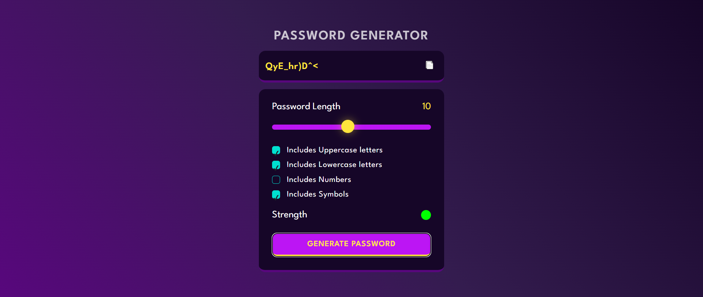

# Password-Generator
A simple password generator that creates strong, random passwords based on user preferences for uppercase, lowercase letters, numbers, and symbols. Features adjustable password length and strength indicators. Includes clipboard copy functionality for convenience.

🔐 Generates random passwords with uppercase, lowercase, numbers, and symbols.  
📏 Adjustable password length. 
📊 Real-time password strength indicator. 
📋 Clipboard copy functionality. 
🔄 Shuffles password for enhanced security. 
✅ User-friendly checkbox-based selection of character types.
